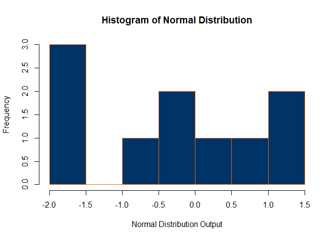

<!-- README.md is generated from README.Rmd. Please edit that file -->

# hw4package

<!-- badges: start -->

<!-- badges: end -->

The goal of hw4package is to get a good grade on Professor Ressler’s
homework 4 assignment for STAT 613 at American University. This package
accomplishes this by create two functions: one that generates random
samples from 4 different distributions, and another that generates plots
of histograms for random samples from 4 different distributions.

## Installation

You can install the released version of hw4package from
[CRAN](https://CRAN.R-project.org) with:

``` r
install.packages("hw4package")
```

And the development version from [GitHub](https://github.com/) with:

``` r
# install.packages("devtools")
devtools::install_github("STAT-413-613-Spring-2020/hw-04-packages-kshrawder")
```

## Usage

This is a basic example of the get\_samples\_dist function which returns
the generated random samples from a selection of 4 different
distributions.

``` r
library(hw4package)
get_samples_dist('normal', 10)
#>  [1]  0.2048434  2.1113419  1.0192561 -0.1260170 -1.0248126  1.0958454
#>  [7] -1.2853905  1.3495468 -0.3652068  1.6381906
```

This is a basic example of the get\_plots\_dist() function which returns
a histogram of the generated random samples from a selection of 4
different distributions.

``` r
get_plots_dist('normal', 10, bins = 5)
```


